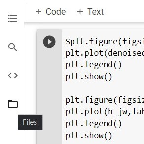
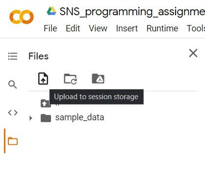
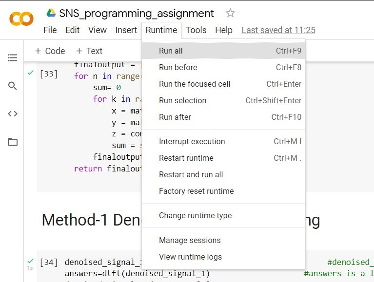

# EEL2010 - Programming Assignment
--- 
By :
>Aryan Tiwari (B20EE010)

>Dhruv (B20EE016) 

***
## Google Colab link :
[https://colab.research.google.com/drive/1doqmMAp6alWgbbuR36edU_1f_n02ZW0v?usp=sharing](https://colab.research.google.com/drive/1doqmMAp6alWgbbuR36edU_1f_n02ZW0v?usp=sharing)
## Guidelines:
    In this folder, there is a Report, Images folder, data.csv file along with this ReadMe file.

## About the Code:
    The code will produce x_1[n] and x_2[n] ,
    x_1[n] is the signal after denoising then deblurring.
    x_2[n] is the signal after deblurring then denoising.
## How to Run the code:

> Step 1: Open Google colaboratory link

> Step 2: Click on files:

.

> Step 3: upload data.csv by clicking on 'upload to session storage' button.

.

> Step 4: click on runtime and then run all. (alternatively, use ctrl+F9)

>Step 5: the code will run and then you will be able to see the various graphs and outputs.
